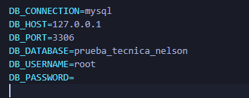

En este archivo explico los pasos que hice para que el proyecto funcionara y cómo arreglé los errores que me fueron saliendo en el camino, para dar sulcion a la problematica planteada

## Flujo d etrabao para la prueba

Tener en cuenta que trabaje con laravel 12 para terminar la prueba, ademas de la conexion para la base de datos que aparece en imagen, igual como sabra es editable sin ningun problema. Por otro lado usar los comnados  `npm run dev` y  `php artisan serve` para que el proyecto funcione correctamente. Primero se debe insertar un usuario  para que aparezac en la vista de lista y posterirmente se debe, hacer llenado del formulario del contrato correspondiente.

## Pasos que realicé

### Instalación de dependencias
Lo primero que hice fue intentar cargar el proyecto, pero me faltaba la carpeta `vendor`. Para solucionarlo ejecuté:
 `composer install`
** Como tuve algunos problemas de compatibilidad con mi versión de PHP, usé: `composer install --ignore-platform-reqs`

### Configuración del archivo .env y la Key
Me apareció el error de que no había una llave de cifrado (encryption key). Los pasos que seguí fueron:
1. Copié el archivo `.env.example` y lo renombré como `.env`. Me di cuenta que fue un error el eliminar la extension del archivo .env.exemple
2. Luego ejecuté el comando: `php artisan key:generate` para que la aplicación tuviera su propia llave de seguridad.

### Testeo de procesos
**Realice el llenado del formulario en la vista para saber si todos los proceso se estaban ejecutando como s ehabia dejado en la prueba

### Corrección de Base de Datos
**Una vez teniendo eso, borré la tabla de personas y la fila de la tabla de migración importada, posteriormente la volví a migrar ya que había elementos cuyos tipos no eran los correctos.

### Visualización de datos y Controlador
**Realicé la parte de la tabla para ver la lista de personas con un diseño de Bootstrap ya definido. Posteriormente, realicé una función en el controlador de personas para obtener los datos de todos los registros que estaban en la tabla de personas; en la web realicé una petición para traer esos datos mediante el controlador y mostrarlos. para mostrar dichos datos en la vista realice una iteracion de los dtos que ya existian en la tabla, consulte como podria tomar el valor del año de la fecha(mediante la funcion carbon parse ya integrada), pude realizar una resta simple mediante una comparacion del dato del año que pase, con el age que toma el año del sistema 

### Logica para mander mensaje con js

**realize un script para que se enviar el mensaje una vez se enviara el formulario, lo hice directamente en blade ya que esto me aseguraba que se realizara despues de que el controlador verifcara que se hizo la inserccion de datos, tuve que realizar una instalacion de los paquetes de node js para poder usar estos scripts mediante  `npm install` y usar el comando  `npm run dev` para ver los resutaldos en tiempo real

### Botón de navegación

**Añadi un botón de navegación para poder ir de vuelta al formulario a insertar datos

### Relacion entre tablas

**Teniendo en cuenta la problematica en la que cad apersona necesita un numero de contrato primero defini la relacion que hay entre estas dos entidades llegando al punto de que es de 1 a muchos, es decir que una persona puede tener muchos contratos, una vez que tenia en mente eso realize el modelo y la migracion de la tabla de contratos con sus respectiva relacion para que pudiera insertar los datos de los contratos

### Controlador

**Mediante una ventana modal realice la logica de asignar el id de la persona al contrato, en la cual hay otro formulario que me permite insertar los datos del contrato, y asignarle la persona selecionada no realice otro controlador para contrato a que considero que no era necesario ya que era una relacion simpe que se podia haer desde el mismo controlador de personas, este proceso me resulto mas facil porque solo tenia que traer los datos de la tabla de contratos y mostrarlos en la vista, proceso que refresque como hacerlo al realizar la lista de personas , ademas de tener un script para traerme los datos de esa persona selecionada en la lista para saber cual seria el id de la persona que se le asignaria el contrato, tambien tene ren cuenta que si una persona ya tiene el contrato  van a aparecer los datos del contrato en el formulario de la persona selecionada para cmabia algun dato. 

**Una vez que que tenia la inserccion de datos en la tabla de contratos realice un script para que se mostrara una alerta una vez que se insertara los datos correctamente, ademas de hacer la condicion para que si no tiene un numero asiganmado coloque N/A si lo tiene, se muestra en la columna

### Conclusiones

Se llego a dar una solucion a etsa problematica, sin embargo simepre hay procesos mejorables en la misma, durante el desarrollo de la prueba pude refrescar el conocimiento que tenia acerca de estas herraminentas de trabajo y me hizo pensar que hay muchas cosas en las que puedo mejorar, ademas de ver cuales eran mis puntos mas debiles como por ejemplo el manejo de los datos en el controlador, pero al menos tuve la noción del funcionamiento de cada parte de este framework para saber de que manera logica hiba a ir cada proceso y que necesitaba para desarrollarlo, esta prueba fue realizada de la forma mas transparente posible con ayuda de documentacion de laravel oficial, investigacion propia y desde el concocimiento basico que tengo, ya que para mi representa una oportunidad de mejorar mis habilidades en este ambito en el que claramente reforzando lo que son las base para trabajar en el mismo en un tiempo arpoximado de 3 horas y media, 2 el dia martes 13/01/2025 y 1:30 minutos el dia de hoy miercoles 14/01/2025, muchas gracias por la oportunidad.
